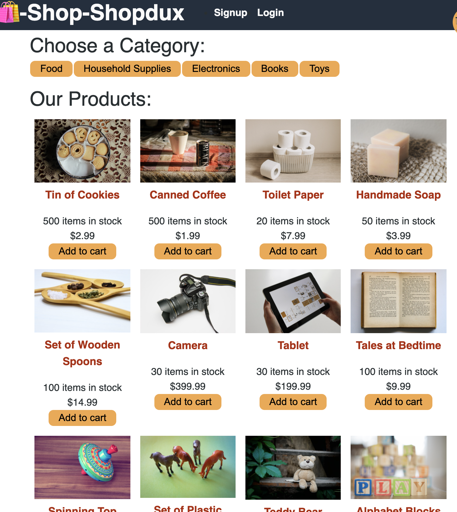

    
    
    
    
    

# Shop-Shopdux

Shop-shopdux is the sister website of [shop-shop](https://github.com/evalecillos/shop-shop) using Redux instead of React context for state variable management.

## Preview 👀
[Live site](https://agile-plains-92114.herokuapp.com/)

## License 📓
[MIT](https://choosealicense.com/licenses/mit/)